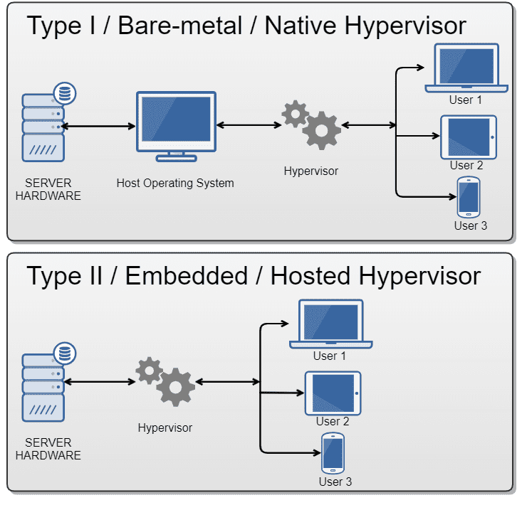
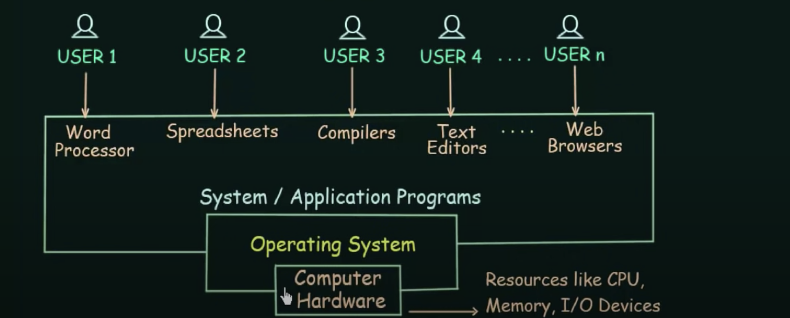
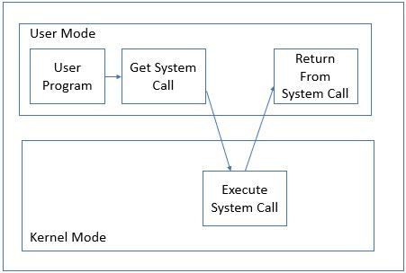

# Born2beRoot

### Summary
This project aims to introduce you to the wonderful world of virtualization.

### Virtualization
Is a technology that allows us to create multiple simulated environments of dedicated resources from a single physical hardware system.

### Virtual machine
Is a sub computer (guest) with  it own OS, in your computer (host). the hypervisor provide the guest whit the hardware (CPU, RAM, Memory ...) needed,

### Hypervisor
A hypervisor is software that virtualizes real physical resources and acts as a medium to make them available to virtual machines.

### Operating system
Most of the time, there are several different computer programs running at the same time, and they all need to access your computer’s central processing unit (CPU), memory, and storage. The operating system coordinates all of this to make sure each program gets what it needs. ( it acts as an intermediary between computer software and hardware).

When a program makes a call to the OS saying "Yo! i need to use a particular resource", the context switch happens where the user mode switch to kernel mode so that the program can use that resource. So the call that the program make in order to access that resource called System call.

User and kernel modes are modes of operation where a program can be executed. When a program executing in the Privileged mode(Kernel mode) and it's happens to crash during execution, then the whole system would crash. but it's not the case for the user mode.

### Debian
Is an operating system that have a lot of sources whitch make it easier for us to work with it, can run on every architecture available in the market, Support for an extensive list of architectures means that it can run on older and newer computer systems and processors.

#### Difference between Debian & Rocky
#### 🔴Debian
- Debian can be easily upgraded from one stable version to another.

- Supported 32bit.

- Debian uses apt as its package manager.

- Debian has a vast amount of packages in its default repository.

- The mother of many descendant operating systems such as Ubuntu.

#### 🔴Rocky

- it is better to install a new Rocky version rather than go to upgrade the older version, and (this is difficult).

- Does not support 32bit.

- Rocky uses YUM & DNF as its package manager.

- Rocky has limited packages.

- Based on RHEL (READ HAT ENTERPRISE LINUX).