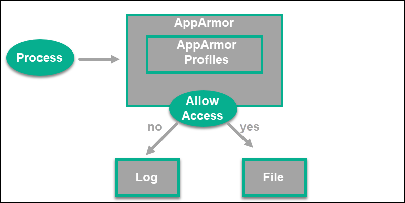
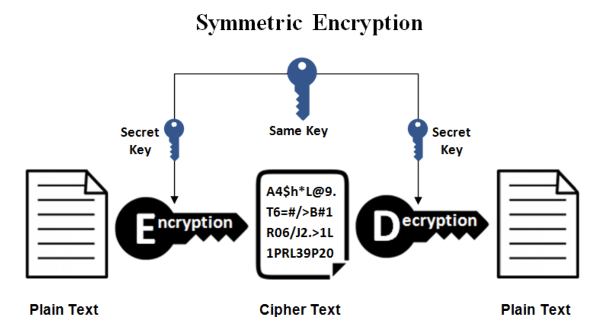
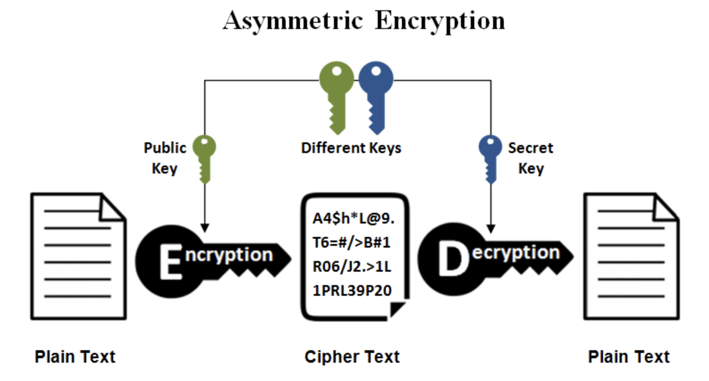
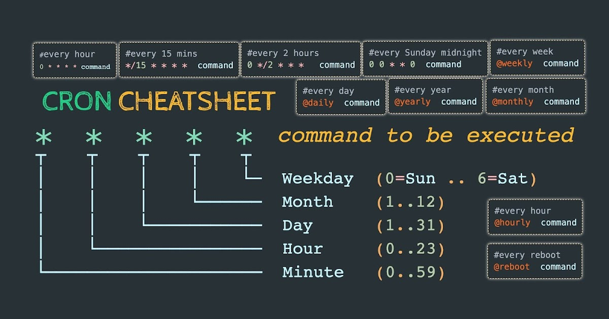
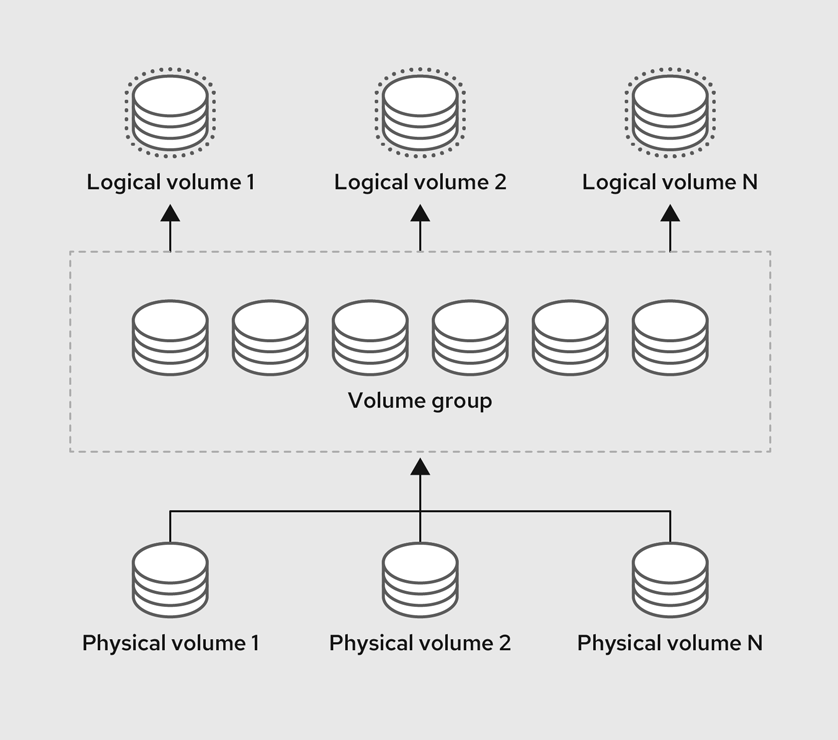
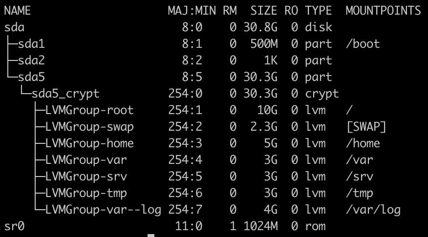

# Born2beRoot

### Summary
This project aims to introduce you to the wonderful world of virtualization.

### Virtualization
Is a technology that allows us to create multiple simulated environments of dedicated resources from a single physical hardware system.

### Virtual machine
Is a sub computer (guest) with  it own OS, in your computer (host). the hypervisor provide the guest whit the hardware (CPU, RAM, Memory ...) needed,

### Hypervisor
A hypervisor is software that virtualizes real physical resources and acts as a medium to make them available to virtual machines.

### Operating system
Most of the time, there are several different computer programs running at the same time, and they all need to access your computer’s central processing unit (CPU), memory, and storage. The operating system coordinates all of this to make sure each program gets what it needs. ( it acts as an intermediary between computer software and hardware).

When a program makes a call to the OS saying "Yo! i need to use a particular resource", the context switch happens where the user mode switch to kernel mode so that the program can use that resource. So the call that the program make in order to access that resource called System call.

User and kernel modes are modes of operation where a program can be executed. When a program executing in the Privileged mode(Kernel mode) and it's happens to crash during execution, then the whole system would crash. but it's not the case for the user mode.

### Debian
Is an operating system that have a lot of sources whitch make it easier for us to work with it, can run on every architecture available in the market, Support for an extensive list of architectures means that it can run on older and newer computer systems and processors.

#### Difference between Debian & Rocky

#### 🔴Debian
- Debian can be easily upgraded from one stable version to another.

- Supported 32bit.

- Debian uses apt as its package manager.

- Debian has a vast amount of packages in its default repository.

- The mother of many descendant operating systems such as Ubuntu.

#### 🔴Rocky

- it is better to install a new Rocky version rather than go to upgrade the older version, and (this is difficult).

- Does not support 32bit.

- Rocky uses YUM & DNF as its package manager.

- Rocky has limited packages.

- Based on RHEL (READ HAT ENTERPRISE LINUX).

### Aptitude&Apt
both are package manager a software tools that automates the process of installing, upgrading, configuring, and moving computer programs.

#### 🔴apt

- low-leve.

- Without a user interface.

- New.

- Apt requires a specific command to remove files eligible for a particular package.

- If the action(installing…) is failed the aptitude can suggest other solutions, reverse apt it will say I can't allow you to do that.

- can moo.

#### 🔴aptitude

- High-level.

- With a user interface.

- Old.

- while aptitude removes them automatically.

- We can use apt in aptitude.

- Can't moo.

### Apparmor

AppArmor is a Mandatory Access Control (MAC) system built on Linux's LSM (Linux Security Modules) interface. In practice, the kernel queries AppArmor before each system call to know whether the process is authorized to do the given operation. Through this mechanism, AppArmor confines programs to a limited set of resources.
AppArmor applies a set of rules (known as “profile”) on each program. The profile applied by the kernel depends on the installation path of the program being executed. Contrary to SELinux, the rules applied do not depend on the user, Each profile can be loaded either in enforcing or complaining mode. The former enforces the policy and reports violation attempts, while the latter does not enforce the policy but still logs the system calls that would have been denied.
for more detiles :https://askubuntu.com/questions/236381/what-is-apparmor

### UFW

UFW (Uncomplicated Firewall) is, as its name suggests, a simple command-line firewall. A firewall is a program that monitors and controls data traffic between a local computer and the network at large. It decides whether to allow or block the traffic according to a set of security rules.
When we talk about traffic and networks, we must understand two things: IP addresses and ports. On the internet, data is transferred from one computer to the other using their IP addresses, which look something like this: 109.234.160.5.
But to avoid conflicts between the various internet protocols, every computer separates the access paths thanks to specified ports, marked after the IP address, like this: 109.234.160.5:80 (port #80).

### SSH
Ssh or (Secure Shell Protocol) is a protocol(a set of rules) that allows 2 machines to communicate securely over a network(Client(Local machine) and Server(Remote machine)). It uses TCP to establish a stable connection and reliable data transfer between the client and the server. It leverages TCP's features such as error checking and congestion control to ensure data integrity and reliability. TCP is a transport layer protocol that manages the individual 'conversations' between web servers and web clients. It ensures data is sent and received in the order it was transmitted and that no data is lost or dropped.
The significant advantage offered by SSH is the use of encryption to ensure a secure transfer of information between the host and the client.
Encryption Techniques:
##### Symmetrical encryption

##### Asymmetrical encryption

for more details :
https://www.adsmurai.com/en/articles/how-to-generate-secure-ssh-keys
https://medium.com/@hellomudit/understanding-ssh-workflow-66a0e8d4bf65

### SUDO

#### the what
sudo or (super-user do) is a program(group) that allows system administrators to give specific users some permissions of the root such as executing some root’s commands so (make a user most powerful). Not all users could use Sudo only Sudo's group members.
The root is the user name or account that by default has access to all commands and files on a Linux or other Unix-like operating system. It is also referred to as the root account, root user, and superuser.

#### the why
It's easy to run only the commands that require special privileges via Sudo; the rest of the time, you work as an unprivileged user, which reduces the damage that mistakes can cause. Auditing/logging: when a Sudo command is executed, the original username and the command are logged.

### Script monitoring

A shell script is a sequence of commands for which you have a repeated use. This sequence is typically executed by entering the name of the script on the command line. Alternatively, you can use scripts to automate tasks using the cron facility.

#### cron

is a Linux task manager that allows us to execute commands automatically at a specific time, We can automate some tasks just by telling cron what command we want to run at a specific time

#### wall

wall displays a message, or the contents of a file, or otherwise its standard input, on the terminals of all currently logged in users.
#### monitoring.sh

The architecture of your operating system and its kernel version.\
	uname -a
The number of physical processors.\
	grep "physical id" /proc/cpuinfo |  uniq | wc -l
The number of virtual processors.\
	grep processor /proc/cpuinfo | sort -u | wc -l
The current available RAM on your server and its utilization rate as a percentage\
	free --mega |grep "Mem:" | awk '{printf("#Memory Usage: %i/%iMB (%.2f%%)\n"$3, $2, ($3/$2)*100)}'
The current available memory on your server and its utilization rate as a percentage.\
	df -h --total | grep total | awk '{printf("#Disk Usage: %i/%iGb (%.2f%%)\n", $3*1024, $2,$5)}'
The current utilization rate of your processors as a percentage.\
	mpstat | grep 'all' | awk '{printf("%.1f%%"),100 - $13}'
The date and time of the last reboot.\
	who -b | awk '$1 == "system" {print $3 " " $4}'
Whether LVM is active or not.\
	if [ $(lsblk | grep "lvm" | wc -l) -eq 0 ]; then echo no; else echo yes; fi
The number of active connections.\
	ss -s | grep TCP: | tr ',' ' '| awk '{print $4}'
The number of users using the server.\
	who | awk '{print($1)}'| sort -u | wc -l
The IPv4 address of your server and its MAC (Media Access Control) address.\
	hostname -I 
	ip link show | grep "ether" | awk '{printf("(%s)",$2)}'
The number of commands executed with the sudo program.\
	ls -l /var/log/sudo/00/00 | wc -l
### Partitions

A disk partition is the reservation of a region on the disk so each region can be managed separately, the partitioning data is stored on special region of the disk called Partitioning table in the MBR (Master boot record).
Master Boot Record is a sector that resides at the very beginning of a disk. it holds data for the disks partitioning and Bootloader instructions to where to find a bootmanager on the dist. It only allows for 4 Partitions, 3 Primary and 1 Extended. 
Partitions types:
 - Primary: a general type partition
 - extended: is a partition that can be divided into multiple sub-partitions called Logical partitions
 BIOS can only boot systems that reside in primary partitions so in order to use Logical partition as root filesystem the boot manager of the OS must be in a separate Primary partition.
Filesystem is a method or a structure the OS follows in order to store or retrieve data from a partition (NTFS, APFS, FAR32, EXT3, EXT4 ...). Filesystem data is stored on the firstmust sector of the partition, called Superblock and it contains the filesystem type, partition label, and a UUID.
for more details : https://miro.com/app/board/uXjVP37UxCE=/

#### LVM

Logical Volume Manager (LVM) is a software tool used in computer systems to manage and organize storage space more flexibly. It allows you to create virtual partitions called logical volumes that can span across multiple physical hard drives.
• Physical Volume (PV): physical storage device. It can be a hard disk, an SD card, a floppy disk, etc. This device provides us with storage available to use.
• Volume Group (VG): to use the space provided by a PV, it must be allocated in a volume group. It is like a virtual storage disk that will be used by logical volumes. VGs can grow over time by adding new VPs.
• Logical volume (LV): these devices will be the ones we will use to create file systems, swaps, virtual machines, etc. If the VG is the storage disk, the LV are the partitions that are made on this disk.

for more details : https://www.youtube.com/watch?v=Eu1WrVjzRy8&t=3s

* sda : physical volume.
* sda1 : praimary partition (in the beginning) mounted ot /boot : It includes the static kernel and bootloader configuration and executable files needed to start a Linux computer.
* sda2 : extanded partition it includes the logical partition table.
* sda5 : logical partition.
* sda5_crypt : encrypted partition (sda5).
* LVMGroup : logical volume group.
* /(root) : It is the top-level filesystem directory. It must include every file needed to boot the Linux system before another filesystem is mounted. Every other filesystem is mounted on a well-defined and standard mount point because of the root filesystem directories after the system is started.
* swap : Used as a temporary storage area for data that is not currently being used by the system. This space is used when the system runs out of physical RAM (Random Access Memory). The swap space acts as an overflow for the RAM, allowing the system to continue running smoothly by temporarily moving some data from RAM to the swap space.
* home : where user's home directorys been storeded
* var : contains data that is expected to change over time, such as system logs, mail, and temporary files
* srv : intended for site-specific data served by the system, making it a place to store data that is specifically related to the operation of services provided by the system.
* tmp : It is a temporary directory used by the OS and several programs for storing temporary files. Also, users may temporarily store files here. Remember that files may be removed without prior notice at any time in this directory.
* var/log : used for storing system log files.
* sr0 : This is the identifier for the first CD-ROM or DVD-ROM drive in your system
for more details : https://www.javatpoint.com/linux-file-system